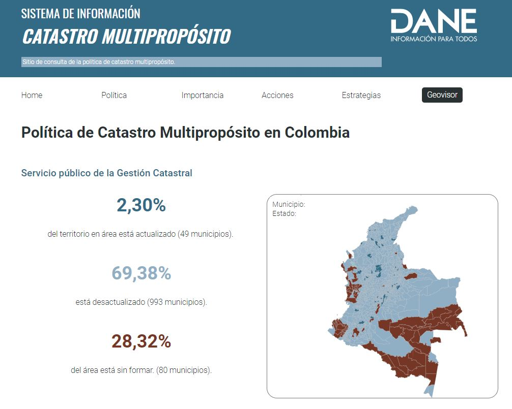

# Micrositio Catastro Multipropósito

Template for displaying web maps using vector tiles




## Installation


1. Install dependences

```bash
npm run i
```

2. Local deploy

first run the start local deploy for modify the web app
```bash
npm run start

```

then run the backend which is deployed on port 3000

```bash
npm run nodemon

```


## Usage

run the command

```bash
npm run build

```
to create the project build in [pip](dist) folder


## Contributing
Pull requests are welcome. For major changes, please open an issue first to discuss what you would like to change.

DANE - COLOMBIA

## License
[MIT](https://choosealicense.com/licenses/mit/)
